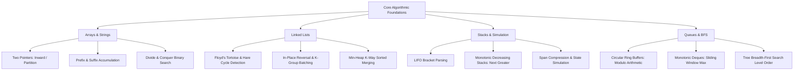

<div align="center">

# 🧠 Applied Coding Skills (S1L10)
### *Comprehensive Data Structures & Algorithms Lab — Weeks 1 to 4*
**VTU Student ID: `VTU29661`**

[](https://leetcode.com/)
[](https://www.java.com/)
[](https://leetcode.com/)
[](https://leetcode.com/)
[](https://leetcode.com/)
[](https://github.com/)

<p align="center">
  A production-ready, benchmarked collection of optimal Java solutions for the <b>Applied Coding Skills (S1L10)</b> course at VTU. Covering core data structures and algorithmic patterns across 4 intensive modules: Arrays, Two Pointers, Linked Lists, Stacks, Monotonic Deques, Circular Ring Buffers, and Breadth-First Search (BFS).
</p>

</div>

---

## 📑 Table of Contents

- [📊 Curriculum Matrix & Statistics](#-curriculum-matrix--statistics)
- [📂 Repository Architecture](#-repository-architecture)
- [📅 Week 1: Arrays, Strings, Two Pointers & Binary Search](#-week-1-arrays-strings-two-pointers--binary-search)
- [📅 Week 2: Linked Lists, Two Pointers & Reversals](#-week-2-linked-lists-two-pointers--reversals)
- [📅 Week 3: Stacks, Monotonic Stacks & Simulation](#-week-3-stacks-monotonic-stacks--simulation)
- [📅 Week 4: Queues, Deques, Monotonic Queues & BFS](#-week-4-queues-deques-monotonic-queues--bfs)
- [🧠 Algorithmic Patterns Mastered](#-algorithmic-patterns-mastered)
- [🚀 Local Setup & Execution Guide](#-local-setup--execution-guide)

---

## 📊 Curriculum Matrix & Statistics

### 📈 Weekly Module Progress

| Week | Core Focus | 🟢 Easy | 🟡 Medium | 🔴 Hard | Total Problems | Status | Module Directory |
| :---: | :--- | :---: | :---: | :---: | :---: | :---: | :---: |
| **Week 1** | Arrays, In-Place Two Pointers, Prefix Sums & Binary Search | 8 | 2 | 0 | **10** |  | [Browse Week 1](./Week-1/README.md) |
| **Week 2** | Singly Linked Lists, Fast & Slow Pointers, K-Way Merges | 5 | 1 | 2 | **8** |  | [Browse Week 2](./Week-2%20/README.md) |
| **Week 3** | LIFO Stacks, Monotonic Stacks & Collision Simulation | 3 | 6 | 0 | **9** |  | [Browse Week 3](./Week-3/README.md) |
| **Week 4** | FIFO Queues, Ring Buffers, Monotonic Deques & Tree BFS | 2 | 6 | 1 | **9** |  | [Browse Week 4](./Week-4/README.md) |
| **Total** | **All 4 Modules** | **18** | **15** | **3** | **36** |  | — |

### 🎯 Overall Difficulty Distribution

```
🟢 Easy       [18 Solved]  █████████████████████████ 50.0%
🟡 Medium     [15 Solved]  █████████████████████     41.7%
🔴 Hard       [ 3 Solved]  ████                      8.3%
─────────────────────────────────────────────────────────────
Total: 36 Solved | 100% Java Solutions | All Test Cases Passed
```

---

## 📂 Repository Architecture

```text
📦 ACS-VTU29661/
├── 📄 README.md                                          # Master repository documentation
├── 📁 Week-1/                                            # Week 1: Arrays, Two Pointers & Binary Search
│   ├── 📄 README.md                                      # Week 1 overview & problem index
│   ├── 0075-sort-colors/                                 # Dutch National Flag (3-way partition)
│   ├── 0121-best-time-to-buy-and-sell-stock/             # Single-pass min tracking
│   ├── 0219-contains-duplicate-ii/                       # Sliding window + HashSet
│   ├── 0283-move-zeroes/                                 # In-place two pointers
│   ├── 0344-reverse-string/                              # Inward two-pointer swap
│   ├── 0387-first-unique-character-in-a-string/          # Frequency array / hash map
│   ├── 0704-binary-search/                               # Classic logarithmic binary search
│   ├── 0977-squares-of-a-sorted-array/                   # Two-pointer inward square merge
│   ├── 1480-running-sum-of-1d-array/                     # In-place prefix sum accumulation
│   └── 1685-sum-of-absolute-differences-in-a-sorted-array/# Prefix & suffix sum optimization
├── 📁 Week-2 /                                           # Week 2: Linked Lists & Two Pointers
│   ├── 📄 README.md                                      # Week 2 overview & problem index
│   ├── 0021-merge-two-sorted-lists/                      # Recursive / dummy-head merge
│   ├── 0023-merge-k-sorted-lists/                        # Min-Heap (PriorityQueue) multi-merge
│   ├── 0025-reverse-nodes-in-k-group/                    # K-group iterative pointer reversal
│   ├── 0142-linked-list-cycle-ii/                        # Floyd's cycle detection & entry math
│   ├── 0160-intersection-of-two-linked-lists/            # Two-pointer path equalization
│   ├── 0206-reverse-linked-list/                         # Iterative 3-pointer reversal
│   ├── 0234-palindrome-linked-list/                      # Fast/slow pointer + half reversal
│   └── 0876-middle-of-the-linked-list/                   # Tortoise & Hare midpoint detection
├── 📁 Week-3/                                            # Week 3: Stacks & Monotonic Stacks
│   ├── 📄 README.md                                      # Week 3 overview & problem index
│   ├── 0020-valid-parentheses/                           # LIFO bracket balancing
│   ├── 0155-min-stack/                                   # Constant-time min retrieval stack
│   ├── 0496-next-greater-element-i/                      # Monotonic decreasing stack + map
│   ├── 0735-asteroid-collision/                          # Collision state simulation
│   ├── 0739-daily-temperatures/                          # Monotonic decreasing index stack
│   ├── 0901-online-stock-span/                           # Span compression via monotonic pairs
│   ├── 0946-validate-stack-sequences/                    # Greedy push-pop simulation
│   ├── 1249-minimum-remove-to-make-valid-parentheses/    # Two-pass index filtering
│   └── 1475-final-prices-with-a-special-discount/        # Monotonic stack next-smaller-element
└── 📁 Week-4/                                            # Week 4: Queues, Deques & Tree BFS
    ├── 📄 README.md                                      # Week 4 overview & problem index
    ├── 0102-binary-tree-level-order-traversal/           # Queue-based Level-Order BFS
    ├── 0199-binary-tree-right-side-view/                 # Level-end projection via BFS
    ├── 0232-implement-queue-using-stacks/                # Amortized O(1) dual-stack queue
    ├── 0239-sliding-window-maximum/                      # Monotonic decreasing deque
    ├── 0621-task-scheduler/                              # Greedy idle slot math
    ├── 0622-design-circular-queue/                       # Fixed-size array ring buffer
    ├── 0641-design-circular-deque/                       # Double-ended array ring buffer
    ├── 0933-number-of-recent-calls/                      # Sliding window queue eviction
    └── 1438-longest-continuous-subarray-with-limit/      # Dual monotonic deques (min/max)
```

---

## 📅 Week 1: Arrays, Strings, Two Pointers & Binary Search

> **Focus:** Memory layout, in-place partitions, pointer convergence, sliding hash sets, prefix accumulations, and binary search.  
> 🔗 **Module Link:** [Detailed Week 1 Documentation](./Week-1/README.md)

| # | Problem Title | Difficulty | Key Pattern / Concept | Time | Space | Performance | Solution | Notes |
| :---: | :--- | :---: | :--- | :---: | :---: | :---: | :---: | :---: |
| 0075 | [Sort Colors](https://leetcode.com/problems/sort-colors/) |  | Dutch National Flag (3-Way Partition) | $O(N)$ | $O(1)$ | `0 ms (100.00%)` | [solution.java](./Week-1/0075-sort-colors/solution.java) | [README.md](./Week-1/0075-sort-colors/README.md) |
| 0121 | [Best Time to Buy & Sell Stock](https://leetcode.com/problems/best-time-to-buy-and-sell-stock/) |  | Single-Pass Min Tracking (Greedy) | $O(N)$ | $O(1)$ | `1 ms (99.96%)` | [solution.java](./Week-1/0121-best-time-to-buy-and-sell-stock/solution.java) | [README.md](./Week-1/0121-best-time-to-buy-and-sell-stock/README.md) |
| 0219 | [Contains Duplicate II](https://leetcode.com/problems/contains-duplicate-ii/) |  | Sliding Window + HashSet | $O(N)$ | $O(\min(N, k))$ | `24 ms (71.34%)` | [solution.java](./Week-1/0219-contains-duplicate-ii/solution.java) | [README.md](./Week-1/0219-contains-duplicate-ii/README.md) |
| 0283 | [Move Zeroes](https://leetcode.com/problems/move-zeroes/) |  | Two Pointers (In-Place Partition) | $O(N)$ | $O(1)$ | `2 ms (92.03%)` | [solution.java](./Week-1/0283-move-zeroes/solution.java) | [README.md](./Week-1/0283-move-zeroes/README.md) |
| 0344 | [Reverse String](https://leetcode.com/problems/reverse-string/) |  | Two Pointers (Opposite Ends Swap) | $O(N)$ | $O(1)$ | `0 ms (100.00%)` | [solution.java](./Week-1/0344-reverse-string/solution.java) | [README.md](./Week-1/0344-reverse-string/README.md) |
| 0387 | [First Unique Character in a String](https://leetcode.com/problems/first-unique-character-in-a-string/) |  | Frequency Array / Two-Pass Scan | $O(N)$ | $O(1)$ | `31 ms (38.93%)` | [solution.java](./Week-1/0387-first-unique-character-in-a-string/solution.java) | [README.md](./Week-1/0387-first-unique-character-in-a-string/README.md) |
| 0704 | [Binary Search](https://leetcode.com/problems/binary-search/) |  | Divide & Conquer Binary Search | $O(\log N)$ | $O(1)$ | `0 ms (100.00%)` | [solution.java](./Week-1/0704-binary-search/solution.java) | [README.md](./Week-1/0704-binary-search/README.md) |
| 0977 | [Squares of a Sorted Array](https://leetcode.com/problems/squares-of-a-sorted-array/) |  | Two Pointers Inward Scan | $O(N)$ | $O(N)$ | `1 ms (100.00%)` | [solution.java](./Week-1/0977-squares-of-a-sorted-array/solution.java) | [README.md](./Week-1/0977-squares-of-a-sorted-array/README.md) |
| 1480 | [Running Sum of 1d Array](https://leetcode.com/problems/running-sum-of-1d-array/) |  | Prefix Sum In-Place Accumulation | $O(N)$ | $O(1)$ | `0 ms (100.00%)` | [solution.java](./Week-1/1480-running-sum-of-1d-array/solution.java) | [README.md](./Week-1/1480-running-sum-of-1d-array/README.md) |
| 1685 | [Sum of Absolute Differences](https://leetcode.com/problems/sum-of-absolute-differences-in-a-sorted-array/) |  | Prefix & Suffix Sum Accumulation | $O(N)$ | $O(1)$ | `4 ms (85.17%)` | [solution.java](./Week-1/1685-sum-of-absolute-differences-in-a-sorted-array/solution.java) | [README.md](./Week-1/1685-sum-of-absolute-differences-in-a-sorted-array/README.md) |

---

## 📅 Week 2: Linked Lists, Two Pointers & Reversals

> **Focus:** Pointer manipulation, fast/slow pointers (Floyd's algorithm), cycle entry math, in-place reversals, and heap-assisted K-way merging.  
> 🔗 **Module Link:** [Detailed Week 2 Documentation](./Week-2%20/README.md)

| # | Problem Title | Difficulty | Key Pattern / Concept | Time | Space | Performance | Solution | Notes |
| :---: | :--- | :---: | :--- | :---: | :---: | :---: | :---: | :---: |
| 0021 | [Merge Two Sorted Lists](https://leetcode.com/problems/merge-two-sorted-lists/) |  | Two Pointers / Recursive Merge | $O(N + M)$ | $O(N + M)$ | `0 ms (100.00%)` | [solution.java](./Week-2%20/0021-merge-two-sorted-lists/solution.java) | [README.md](./Week-2%20/0021-merge-two-sorted-lists/README.md) |
| 0023 | [Merge k Sorted Lists](https://leetcode.com/problems/merge-k-sorted-lists/) |  | Min-Heap / PriorityQueue Multi-Merge | $O(N \log k)$ | $O(k)$ | `5 ms (40.75%)` | [solution.java](./Week-2%20/0023-merge-k-sorted-lists/solution.java) | [README.md](./Week-2%20/0023-merge-k-sorted-lists/README.md) |
| 0025 | [Reverse Nodes in k-Group](https://leetcode.com/problems/reverse-nodes-in-k-group/) |  | Group Pointer Reversal & Stitching | $O(N)$ | $O(1)$ | `1 ms (34.55%)` | [solution.java](./Week-2%20/0025-reverse-nodes-in-k-group/solution.java) | [README.md](./Week-2%20/0025-reverse-nodes-in-k-group/README.md) |
| 0142 | [Linked List Cycle II](https://leetcode.com/problems/linked-list-cycle-ii/) |  | Floyd's Cycle-Finding Algorithm | $O(N)$ | $O(1)$ | `0 ms (100.00%)` | [solution.java](./Week-2%20/0142-linked-list-cycle-ii/solution.java) | [README.md](./Week-2%20/0142-linked-list-cycle-ii/README.md) |
| 0160 | [Intersection of Two Linked Lists](https://leetcode.com/problems/intersection-of-two-linked-lists/) |  | Two Pointers (Traversal Alignment) | $O(N + M)$ | $O(1)$ | `1 ms (99.90%)` | [solution.java](./Week-2%20/0160-intersection-of-two-linked-lists/solution.java) | [README.md](./Week-2%20/0160-intersection-of-two-linked-lists/README.md) |
| 0206 | [Reverse Linked List](https://leetcode.com/problems/reverse-linked-list/) |  | Iterative 3-Pointer In-Place Reversal | $O(N)$ | $O(1)$ | `0 ms (100.00%)` | [solution.java](./Week-2%20/0206-reverse-linked-list/solution.java) | [README.md](./Week-2%20/0206-reverse-linked-list/README.md) |
| 0234 | [Palindrome Linked List](https://leetcode.com/problems/palindrome-linked-list/) |  | Fast/Slow Pointer + Half Reversal | $O(N)$ | $O(1)$ | `3 ms (99.83%)` | [solution.java](./Week-2%20/0234-palindrome-linked-list/solution.java) | [README.md](./Week-2%20/0234-palindrome-linked-list/README.md) |
| 0876 | [Middle of the Linked List](https://leetcode.com/problems/middle-of-the-linked-list/) |  | Fast & Slow Pointer (Tortoise & Hare) | $O(N)$ | $O(1)$ | `0 ms (100.00%)` | [solution.java](./Week-2%20/0876-middle-of-the-linked-list/solution.java) | [README.md](./Week-2%20/0876-middle-of-the-linked-list/README.md) |

---

## 📅 Week 3: Stacks, Monotonic Stacks & Simulation

> **Focus:** LIFO data structures, monotonic decreasing stacks for next greater queries, span compression, and state simulation.  
> 🔗 **Module Link:** [Detailed Week 3 Documentation](./Week-3/README.md)

| # | Problem Title | Difficulty | Key Pattern / Concept | Time | Space | Performance | Solution | Notes |
| :---: | :--- | :---: | :--- | :---: | :---: | :---: | :---: | :---: |
| 0020 | [Valid Parentheses](https://leetcode.com/problems/valid-parentheses/) |  | LIFO Bracket Matching | $O(N)$ | $O(N)$ | `3 ms (86.07%)` | [solution.java](./Week-3/0020-valid-parentheses/solution.java) | [README.md](./Week-3/0020-valid-parentheses/README.md) |
| 0155 | [Min Stack](https://leetcode.com/problems/min-stack/) |  | Dual Stack / Paired Min State | $O(1)$ | $O(N)$ | `34 ms (61.77%)` | [solution.java](./Week-3/0155-min-stack/solution.java) | [README.md](./Week-3/0155-min-stack/README.md) |
| 0496 | [Next Greater Element I](https://leetcode.com/problems/next-greater-element-i/) |  | Monotonic Decreasing Stack + Map | $O(N + M)$ | $O(N)$ | `2 ms (99.48%)` | [solution.java](./Week-3/0496-next-greater-element-i/solution.java) | [README.md](./Week-3/0496-next-greater-element-i/README.md) |
| 0735 | [Asteroid Collision](https://leetcode.com/problems/asteroid-collision/) |  | Stack State Collision Simulation | $O(N)$ | $O(N)$ | `5 ms (67.32%)` | [solution.java](./Week-3/0735-asteroid-collision/solution.java) | [README.md](./Week-3/0735-asteroid-collision/README.md) |
| 0739 | [Daily Temperatures](https://leetcode.com/problems/daily-temperatures/) |  | Monotonic Decreasing Index Stack | $O(N)$ | $O(N)$ | `71 ms (38.95%)` | [solution.java](./Week-3/0739-daily-temperatures/solution.java) | [README.md](./Week-3/0739-daily-temperatures/README.md) |
| 0901 | [Online Stock Span](https://leetcode.com/problems/online-stock-span/) |  | Monotonic Stack with Span Compression | $O(1)$ *amortized* | $O(N)$ | `31 ms (60.14%)` | [solution.java](./Week-3/0901-online-stock-span/solution.java) | [README.md](./Week-3/0901-online-stock-span/README.md) |
| 0946 | [Validate Stack Sequences](https://leetcode.com/problems/validate-stack-sequences/) |  | Greedy Push-Pop Simulation | $O(N)$ | $O(N)$ | `2 ms (88.46%)` | [solution.java](./Week-3/0946-validate-stack-sequences/solution.java) | [README.md](./Week-3/0946-validate-stack-sequences/README.md) |
| 1249 | [Min Remove Valid Parentheses](https://leetcode.com/problems/minimum-remove-to-make-valid-parentheses/) |  | Index Stack / Two-Pass Filter | $O(N)$ | $O(N)$ | `6 ms (97.91%)` | [solution.java](./Week-3/1249-minimum-remove-to-make-valid-parentheses/solution.java) | [README.md](./Week-3/1249-minimum-remove-to-make-valid-parentheses/README.md) |
| 1475 | [Final Prices Special Discount](https://leetcode.com/problems/final-prices-with-a-special-discount-in-a-shop/) |  | Monotonic Stack (Next Smaller Element) | $O(N)$ | $O(N)$ | `1 ms (99.79%)` | [solution.java](./Week-3/1475-final-prices-with-a-special-discount-in-a-shop/solution.java) | [README.md](./Week-3/1475-final-prices-with-a-special-discount-in-a-shop/README.md) |

---

## 📅 Week 4: Queues, Deques, Monotonic Queues & BFS

> **Focus:** FIFO structures, array ring buffers, double-ended queues, sliding window maximums, task scheduling, and Breadth-First Search.  
> 🔗 **Module Link:** [Detailed Week 4 Documentation](./Week-4/README.md)

| # | Problem Title | Difficulty | Key Pattern / Concept | Time | Space | Performance | Solution | Notes |
| :---: | :--- | :---: | :--- | :---: | :---: | :---: | :---: | :---: |
| 0102 | [Binary Tree Level Order Traversal](https://leetcode.com/problems/binary-tree-level-order-traversal/) |  | Breadth-First Search (BFS) / Queue | $O(N)$ | $O(N)$ | `1 ms (95.80%)` | [solution.java](./Week-4/0102-binary-tree-level-order-traversal/solution.java) | [README.md](./Week-4/0102-binary-tree-level-order-traversal/README.md) |
| 0199 | [Binary Tree Right Side View](https://leetcode.com/problems/binary-tree-right-side-view/) |  | BFS Level-End / Depth-First Scan | $O(N)$ | $O(H)$ | `0 ms (100.00%)` | [solution.java](./Week-4/0199-binary-tree-right-side-view/solution.java) | [README.md](./Week-4/0199-binary-tree-right-side-view/README.md) |
| 0232 | [Implement Queue using Stacks](https://leetcode.com/problems/implement-queue-using-stacks/) |  | Dual Stacks / Amortized FIFO | $O(1)$ *amortized* | $O(N)$ | `2 ms (18.03%)` | [solution.java](./Week-4/0232-implement-queue-using-stacks/solution.java) | [README.md](./Week-4/0232-implement-queue-using-stacks/README.md) |
| 0239 | [Sliding Window Maximum](https://leetcode.com/problems/sliding-window-maximum/) |  | Monotonic Decreasing Deque | $O(N)$ | $O(k)$ | `29 ms (85.20%)` | [solution.java](./Week-4/0239-sliding-window-maximum/solution.java) | [README.md](./Week-4/0239-sliding-window-maximum/README.md) |
| 0621 | [Task Scheduler](https://leetcode.com/problems/task-scheduler/) |  | Greedy / Frequency & Idle Slots | $O(N)$ | $O(1)$ | `4 ms (73.21%)` | [solution.java](./Week-4/0621-task-scheduler/solution.java) | [README.md](./Week-4/0621-task-scheduler/README.md) |
| 0622 | [Design Circular Queue](https://leetcode.com/problems/design-circular-queue/) |  | Ring Buffer Array / Modulo Math | $O(1)$ | $O(k)$ | `4 ms (100.00%)` | [solution.java](./Week-4/0622-design-circular-queue/solution.java) | [README.md](./Week-4/0622-design-circular-queue/README.md) |
| 0641 | [Design Circular Deque](https://leetcode.com/problems/design-circular-deque/) |  | Circular Array / Head-Tail Pointers | $O(1)$ | $O(k)$ | `4 ms (100.00%)` | [solution.java](./Week-4/0641-design-circular-deque/solution.java) | [README.md](./Week-4/0641-design-circular-deque/README.md) |
| 0933 | [Number of Recent Calls](https://leetcode.com/problems/number-of-recent-calls/) |  | Sliding Window Queue / Eviction | $O(1)$ *amortized* | $O(W)$ | `19 ms (93.36%)` | [solution.java](./Week-4/0933-number-of-recent-calls/solution.java) | [README.md](./Week-4/0933-number-of-recent-calls/README.md) |
| 1438 | [Longest Continuous Subarray Limit](https://leetcode.com/problems/longest-continuous-subarray-with-absolute-diff-less-than-or-equal-to-limit/) |  | Dual Monotonic Deques (Min/Max) | $O(N)$ | $O(N)$ | `29 ms (96.61%)` | [solution.java](./Week-4/1438-longest-continuous-subarray-with-absolute-diff-less-than-or-equal-to-limit/solution.java) | [README.md](./Week-4/1438-longest-continuous-subarray-with-absolute-diff-less-than-or-equal-to-limit/README.md) |

---

## 🧠 Algorithmic Patterns Mastered



### 1. Two Pointers & In-Place Partitions
- Used in **Sort Colors (0075)** for Dutch National Flag 3-way partitioning with $O(1)$ memory.
- Used in **Move Zeroes (0283)** and **Reverse String (0344)** for $O(N)$ single-pass transformations.
- Dual-pointer inward convergence in **Squares of a Sorted Array (0977)** avoiding an $O(N \log N)$ sort.

### 2. Fast & Slow Pointer (Floyd's Tortoise & Hare)
- Detects cycles and resolves the cycle origin in **Linked List Cycle II (0142)** with $O(1)$ space.
- Identifies list midpoints in a single pass in **Middle of the Linked List (0876)** and **Palindrome Linked List (0234)**.

### 3. Monotonic Stacks
- Eliminates $O(N^2)$ brute-force searches for next-greater or next-smaller elements in **Next Greater Element I (0496)**, **Daily Temperatures (0739)**, and **Final Prices (1475)**.
- Compresses continuous intervals online in **Online Stock Span (0901)** in amortized $O(1)$ time per query.

### 4. Monotonic Deques & Sliding Window Extremums
- Maintains elements in decreasing order within a double-ended queue to answer maximum queries in $O(1)$ for **Sliding Window Maximum (0239)**.
- Coordinates simultaneous minimum and maximum monotonic deques in **Longest Continuous Subarray (1438)** to dynamically enforce absolute difference limits.

### 5. Circular Ring Buffers & FIFO Queues
- Uses array indexing and modulo arithmetic (`(tail + 1) % capacity`) in **Design Circular Queue (0622)** and **Design Circular Deque (0641)** for zero-allocation $O(1)$ ring buffers.
- Simulates FIFO queues using two LIFO stacks with amortized $O(1)$ operations in **Implement Queue using Stacks (0232)**.

### 6. Breadth-First Search (BFS)
- Traverses trees level by level using FIFO queues in **Binary Tree Level Order Traversal (0102)** and extracts the outermost right boundaries in **Binary Tree Right Side View (0199)**.

---

## 🚀 Local Setup & Execution Guide

### Prerequisites
- **Java Development Kit (JDK):** Version 17 or higher recommended (e.g., OpenJDK 17 / 21)
- **Terminal / Shell:** `zsh` or `bash`
- **IDE (Optional):** IntelliJ IDEA, Eclipse, or Visual Studio Code

### Verification
```bash
# Check Java compiler and runtime version
javac -version
java -version
```

### Compiling and Running Solutions

All solutions are standalone Java classes organized by problem directory. You can compile and inspect any solution:

```bash
# Example 1: Week 1 - Sort Colors
cd Week-1/0075-sort-colors
javac solution.java

# Example 2: Week 3 - Daily Temperatures
cd ../../Week-3/0739-daily-temperatures
javac solution.java

# Example 3: Week 4 - Sliding Window Maximum
cd ../../Week-4/0239-sliding-window-maximum
javac solution.java
```

---

<div align="center">

**Applied Coding Skills (S1L10) — VTU29661**  
*Curated & benchmarked for excellence in algorithmic problem solving.*

</div>